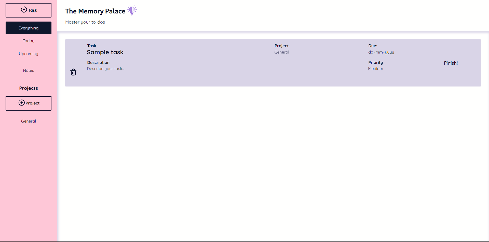

# Todo List

Enter the Memory Palace, a web application designed to record todo items, related projects and any important notes. This is implemented using HTML, CSS, JavaScript and Webpack, showcasing various levels on DOM manipulation through JavaScript, implementation of **Single Responsibility principle** and the implementation of **Local Storage**.

Check it out :point_right:[here!](https://mell62.github.io/todo-list/):point_left:

## :joystick: Features

- Tasks, associated with at least one project
- Notes
- Multiple-tab browsing
- Local storage saves your stuff
- Tasks are sorted priority-wise
- Edit any attributes of or delete any task or note
- Filter tasks pending for today or pending for this week (Upcoming)
- Filter tasks according to its project
- Edit only one task at a time

## :tada: Achievements

- **Webpack** is utilized for the bundling of code of multiple files through ES6 Modules and minification
- **Local Storage** is implemented to add persistence to the application, for both tasks and notes
- Usage of **JSON methods** to implement local storage
- **Single responsibility principle** applied to develop many functions and modules

## :magic_wand: Extras!

- Delete or rename projects at one go
- Due dates prior to today cannot be selected
- Works even when local storage is disabled within the browser

## :page_with_curl: Note

- Modern normalize is used for cross-browser consistency
